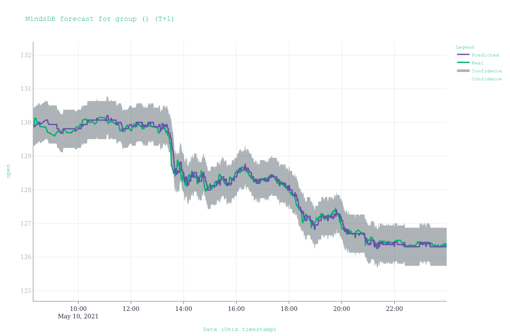

# MindsDB Forecast Visualizer

The purpose of this tool is to aid in obtaining quick visualizations for time series forecasts provided by a Lightwood predictor.

At the moment, the tool supports predictors trained with `lightwood >= 1.0`, but support for 3rd party models is coming soon~ish.

## Documentation

For now, there is no documentation as the package itself is fairly minimal.

However, most functionality is showcased through examples. Please refer to:

* `example/train.py` to train a Lightwood forecaster for airplane arrival data (which includes 4 different time series)
* `example/visualize.py` to plot predictions from this model in your web browser
* `example/visualize.ipynb` to plot predictions from this model inside a jupyter notebook

Note: if you've cloned the repository (as opposed to `pip install`ing), make sure the path to `mindsdb_forecast_visualizer` is added to your python path environment variable before running these scripts from the package root folder.
